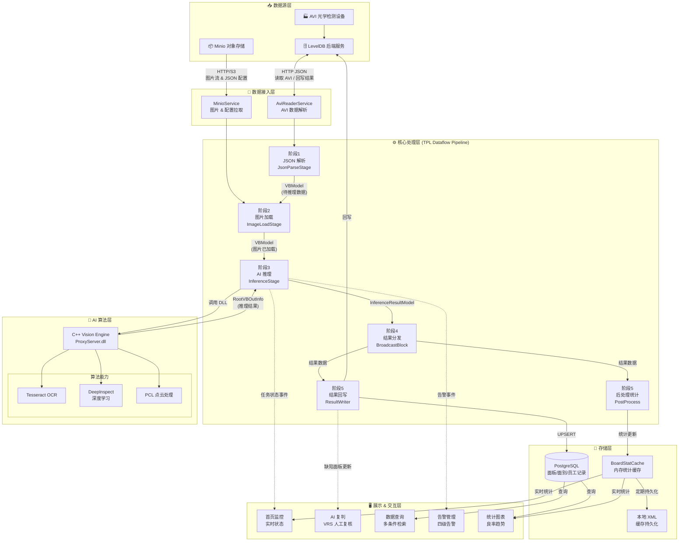
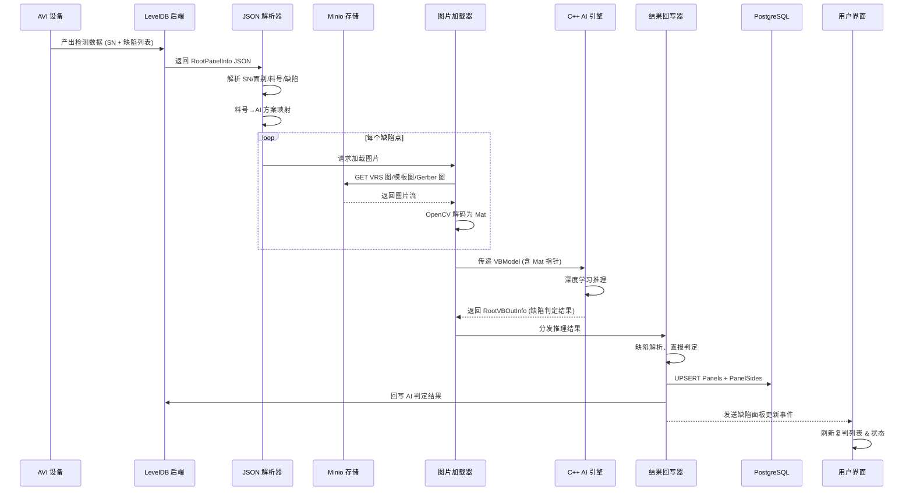
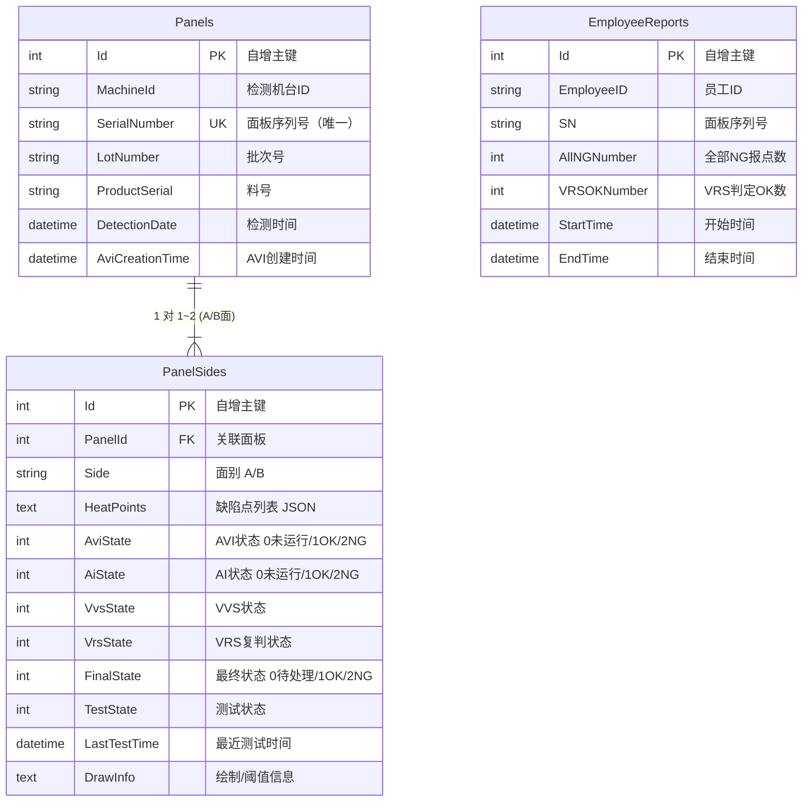
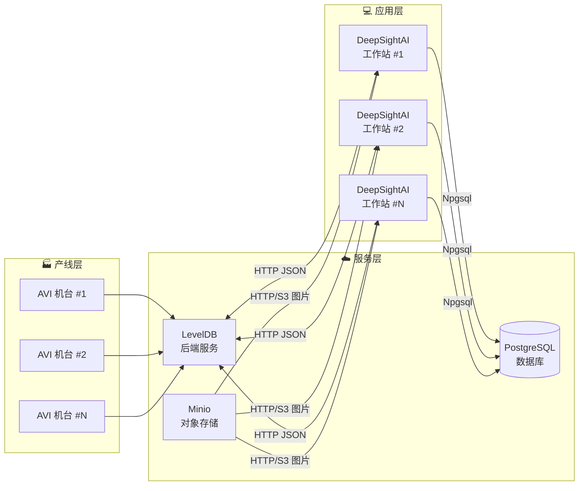

# DeepSightAI 产品建设文档

## 1. 主要功能

### 1.1 产品概述

DeepSightAI 是一款面向 **PCB/电子制造行业** 的智能缺陷检测与复判平台。系统基于机器视觉与深度学习技术，对 AVI（自动光学检测）设备产出的检测数据进行 AI 二次智能分析，实现对缺陷的自动分类、过滤与判定，大幅降低人工复判成本，提升产线良率管控效率。

### 1.2 核心功能模块

#### 1.2.1 AVI 数据接入与解析

- 支持通过 **LevelDB 后端服务**（HTTP JSON 协议）拉取 AVI 设备产出的原始检测数据
- 自动解析面板序列号（SN）、批次号（Lot）、料号（ProductSerial）、面别（A/B 面）、缺陷热力点列表等关键信息
- 支持多机台、多产线并发接入，通过机台注册表统一管理

#### 1.2.2 AI 智能推理引擎

- 集成 **C++ Vision Engine** 深度学习推理框架（基于 TensorRT 8.5 + OpenCV 4.8）
- 支持多种推理模式：
  - **正常推理**：对 AVI 报出的 NG 点进行 AI 二次判定，过滤误报（Overkill）
  - **一致性测试**：新旧模型/参数对比，输出一致率、漏检数、误检数
  - **二次推理**：对历史 NG 点重新推理并覆写结果
  - **单图测试**：快速验证单张图片的推理效果
- 支持字符识别（Tesseract OCR）、点云处理（PCL）、Gerber 图比对等辅助算法
- 支持料号→AI 方案流程的自动映射（AISolutionConfig）

#### 1.2.3 图片加载与管理

- 通过 **Minio 对象存储** 拉取 VRS 图片、模板图、Gerber 图
- 采用 OpenCV（OpenCvSharp4）进行内存解码与预处理
- 并发下载 + 背压控制（BoundedCapacity），防止内存溢出
- 支持流式加载与 Mat 指针直传推理引擎，减少内存拷贝

#### 1.2.4 VRS 人工复判

- 提供 **可视化复判界面**，展示缺陷 ROI 区域、模板图、Gerber 图三图对比
- 支持快捷键快速标记（VVS_OK / VVS_NG / 未设置）
- 支持键盘翻页/翻行/翻图，提升复判效率
- 自动记录员工复判操作（EmployeeReports），用于绩效考核与追溯

#### 1.2.5 热力图与数据可视化

- **热力图叠加**：将缺陷密度以热力图形式叠加到面板图上，直观展示缺陷分布
- **缺陷框绘制**：在原始图片上绘制缺陷 ROI 矩形框与缺陷信息
- **统计图表**：支持按机台、料号、批次、时间等维度生成良率趋势图与缺陷分布图

#### 1.2.6 告警与事件系统

- 结构化告警体系，支持四级告警：**Info → Warning → Error → Critical**
- 告警分类：通信异常、AI 引擎异常、系统异常、数据库异常
- 告警消息实时推送到 UI 告警面板
- 完整的日志系统，支持异步持久化与按天清理

#### 1.2.7 数据查询与追溯

- 支持按 **SN / 批次 / 料号 / 机台 / 时间范围** 多条件组合查询
- 完整记录每块面板 A/B 面的 AVI、AI、VVS、VRS 各阶段状态
- 支持 CSV 数据导出与批量导入

#### 1.2.8 配置管理中心

- JSON 格式配置文件，统一存放于 `configs/` 目录
- 支持常规参数、AI 方案流程、数据库连接、机台注册、重点缺陷规则等独立配置
- 旧版配置自动迁移，向下兼容
- 部分配置支持运行时热更新

---

## 2. 产品亮点

### 2.1 高性能异步流水线架构

系统采用 **TPL Dataflow** 构建五阶段异步处理管道：

```
JSON解析 → 图片加载 → AI推理 → 结果分发 → [持久化 + 后处理]
```

- 各阶段独立并发，充分利用多核 CPU
- BoundedCapacity 背压机制，自动限制内存占用
- 单线程数据库队列，避免连接竞争，保证操作有序性

### 2.2 过杀过滤，降低人工成本

AI 引擎对 AVI 设备产出的 NG 点进行智能二次判定，有效过滤误报（Overkill），将真正需要人工确认的缺陷数量大幅降低。结合 VRS 快捷键复判系统，人均复判效率提升 **3~5 倍**。

### 2.3 多推理模式灵活切换

- **一致性测试模式**：上线新模型前可快速验证新旧模型的一致性，输出量化对比报告
- **二次推理模式**：模型升级后可对历史数据批量回推理，无需重新过线
- **单图测试模式**：支持研发人员快速调试单张图片的推理效果

### 2.4 完善的配置与方案管理

- 料号→AI 方案流程的自动映射，支持一个平台管理多种产品
- 多机台统一注册管理，支持产线横向扩展
- 配置版本兼容与自动迁移，升级无忧

### 2.5 结构化告警与全链路日志

- 四级告警 + 多分类标签，问题定位精准
- 全链路日志记录（AI↔DB 通信日志、推理耗时、异常堆栈）
- 告警实时推送 UI，异常不遗漏

### 2.6 模块化可扩展架构

- 基于接口的依赖注入设计，核心组件均可替换
- Pipeline 阶段独立，可灵活增减处理环节
- 算法插件化，支持流程扩展与新算法接入

### 2.7 可靠的部署与运维支持

- Inno Setup 安装包，集成 PostgreSQL 一键部署
- 版本号自动化管理（PowerShell 脚本）
- 全局异常捕获 + 单实例限制，保障运行稳定

---

## 3. 产品主要对接形式

### 3.1 上游对接：AVI 检测数据源

| 对接系统 | 协议 | 数据格式 | 说明 |
|----------|------|----------|------|
| **LevelDB 后端服务** | HTTP POST | JSON | 拉取 AVI 原始检测数据（面板信息、缺陷列表），回写 AI 复判结果 |
| **Minio 对象存储** | HTTP / S3 API | Binary (JPEG/PNG) | 拉取 VRS 缺陷图片、模板图、Gerber 图；读取 JSON 配置文件 |

#### LevelDB 交互示例

**读取 AVI 数据**：

```json
// 请求: POST http://{leveldb_host}:{port}/api/avi/read
{
  "machine_id": "Machine-01",
  "start_time": "2025-05-19 00:00:00",
  "end_time": "2025-05-19 23:59:59"
}

// 响应:
{
  "code": 0,
  "data": [
    {
      "SerialNumber": "SN123456",
      "LotId": "LOT001",
      "ProductSerial": "PN-001-A",
      "PanelInfos": [{
        "Side": "A",
        "HeatPoints": [{
          "Index": 0,
          "DefectCode": "D001",
          "RoiX": 100, "RoiY": 200,
          "Width": 50, "Height": 50,
          "ImagePath": "SN123456/A/image_0.jpg"
        }]
      }]
    }
  ]
}
```

**回写 AI 结果**：

```json
// 请求: POST http://{leveldb_host}:{port}/api/avi/write
{
  "SerialNumber": "SN123456",
  "Side": "A",
  "AiState": 1,
  "Defects": [...]
}
```

#### Minio 对象存储交互

| 操作 | 说明 |
|------|------|
| `ReadJsonSync(bucket, objectName, ip)` | 同步读取 JSON 配置文件 |
| `GetImageStreamSync(bucket, objectName, ip)` | 同步获取图片流 |
| `ListSubFoldersAsync(bucket, prefix, ip)` | 异步列出子目录 |

### 3.2 下游对接：持久化存储

| 对接系统 | 协议 | 说明 |
|----------|------|------|
| **PostgreSQL** | TCP / Npgsql | 面板数据、面别结果、员工复判记录持久化存储 |

#### PostgreSQL 核心配置

```json
{
  "Host": "localhost",
  "Port": 5432,
  "Database": "deepsight",
  "Username": "postgres",
  "Password": "deepsightai",
  "MaxPoolSize": 100,
  "MinPoolSize": 1,
  "Timeout": 30,
  "TcpKeepalive": true
}
```

### 3.3 核心对接：AI 推理引擎

| 对接系统 | 协议 | 说明 |
|----------|------|------|
| **C++ Vision Engine** (ProxyServer.dll) | DLL 直接调用 / 内存指针传递 | 缺陷检测核心算法 |

#### 推理接口

| 方法 | 说明 |
|------|------|
| `Vision_runMethod(json)` | JSON 输入 → JSON 输出（标准模式） |
| `InferenceWithImages(matPtrs)` | 直传 OpenCV Mat 指针（高性能模式） |

#### 推理输入格式（RootVBInfo）

```json
{
  "message_type": "infer_request",
  "params": {
    "infer_res_uuid": "uuid-123",
    "infer_whole_data": {
      "image_infer_params": {
        "pipeline_name": "PipelineA",
        "node_params": [...]
      },
      "image_data": { ... },
      "other_infos": {
        "image_minio": {
          "access_key": "minioadmin",
          "bucket": "deepsight",
          "endpoint_address": "192.168.1.100",
          "port": "9000"
        }
      }
    }
  }
}
```

#### 推理输出格式（RootVBOutInfo）

```json
{
  "code": "0",
  "msg": "success",
  "data": {
    "infer_res_uuid": "uuid-123",
    "infer_whole_data": {
      "infer_results": [
        {
          "group_uuid": "group-0",
          "infer_result": "NG",
          "defect_name": "孔洞",
          "defect_code": "D001",
          "img_roi": [100, 200, 50, 50],
          "infer_details": {
            "defect_area": "2500",
            "drawinfo": ["..."]
          }
        }
      ]
    }
  }
}
```

### 3.4 对接总览表

| 序号 | 对接方 | 方向 | 协议 | 数据内容 |
|------|--------|------|------|----------|
| ① | LevelDB 后端 | 双向 | HTTP JSON | AVI 原始数据读取 + AI 结果回写 |
| ② | Minio 对象存储 | 读取 | HTTP / S3 | VRS 图片、模板图、Gerber 图、配置文件 |
| ③ | C++ AI 推理引擎 | 调用 | DLL / 内存指针 | 缺陷检测推理请求与结果 |
| ④ | PostgreSQL 数据库 | 写入 | TCP / Npgsql | 面板、面别、员工复判记录 |
| ⑤ | 配置文件系统 | 读取 | 本地 JSON | 常规配置、AI 方案、机台注册、告警规则 |

---

## 4. 数据流通图表

### 4.1 整体系统数据流架构



### 4.2 单块面板检测数据流（时序图）



### 4.3 数据模型关系图



### 4.4 系统部署架构图



---

> **文档版本**：v1.0  
> **最后更新**：2025-05-19  
> **适用范围**：DeepSightAI 产品建设与售前介绍
